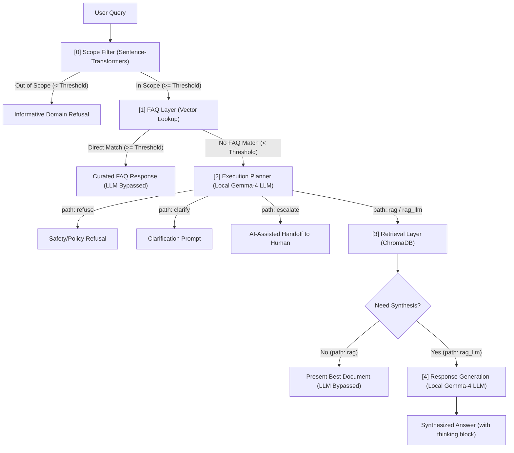

# AI Support Routing System 

**Routing system for e-commerce customer support that combines deterministic routing, bounded retrieval, and local LLM inference to minimise unnecessary generation.**

---
Large language models are often treated as the entry point for AI assistants. This project explores the opposite design philosophy. Rather than routing every customer query directly through an LLM, the system progressively escalates requests through deterministic semantic filters, curated retrieval, and local generation only when each cheaper alternative has been exhausted.

The result is an orchestration pipeline designed around predictable behaviour, bounded inference, and explicit uncertainty—prioritising engineering control over maximal model usage.

<p align="center">
    <kbd>
        
    </kbd>
</p>

---

## 🎯 Design Principles

* **Deterministic Before Probabilistic**: Resolve or reject queries using fast, cached semantic lookups (Scope and FAQ layers) before invoking generative models. *Risk*: Static similarity thresholds can cause false positives, misclassifying valid queries as out-of-scope or routing them to incorrect FAQs.
* **LLM as a Controlled Capability**: Treat the LLM as a schema-constrained utility rather than the main loop. Enforce output structures via Pydantic schemas (supporting Enums if needed) using LangChain bindings to guarantee JSON structure during planning and strict grounding during synthesis.
* **Graceful Degradation over Silent Failure**: Explicitly handle failure modes at each stage. Present raw retrieved documents if synthesis fails, and return static domain refusals if retrieval returns nothing, reducing opportunities for hallucinations.
* **Bounded Latency via Single-Pass Retrieval**: Execute search database lookups in a single pass without multi-turn agent loops, guaranteeing predictable response latency bounds suitable for real-time support.

---

## 🏗️ System Architecture

The pipeline processes user queries sequentially, escalating through each layer based on similarity metrics and path classification:



---

## ⚙️ Pipeline Design

The pipeline consists of five sequential stages implemented in `router_logic.py`.

| Stage | Goal | Trade-off |
|-------|------|-----------|
| **1. Scope Filter** (`run_scope_filter`) | Prevent out-of-scope queries from consuming resources and exposing downstream components by computing semantic similarity against predefined intent centroids (`data/intents.json`) using `all-MiniLM-L6-v2`, rejecting queries below the **Scope Threshold** (default: `0.40`). | Higher thresholds increase false negatives, while lower thresholds allow more irrelevant queries through. |
| **2. FAQ Layer** (`run_faq_layer`) | Eliminate unnecessary LLM calls for repetitive queries by performing vector similarity search over embedded FAQ pairs (`data/Ecommerce_FAQ_Chatbot_dataset.json`) and returning curated answers above the **FAQ Match Threshold** (default: `0.80`). | Fast and cost-free, but static answers cannot adapt to dynamic user-specific information. |
| **3. Execution Planner** (`run_execution_planner`) | Enable deterministic pipeline routing by classifying requests into `refuse`, `clarify`, `rag`, `rag_llm`, or `escalate` using local `Gemma-4-E2B-it`, with outputs enforced through LangChain's native Pydantic parser. | Schema enforcement adds latency but guarantees deterministic, parseable routing outputs. |
| **4. Retrieval Layer** (`run_retrieval_layer`) | Preserve document structure and improve retrieval reliability by parsing PDFs with IBM `Docling`, indexing them in local `ChromaDB`, and filtering retrieved context using a **Retrieval Similarity Threshold** (default: `0.30`). | Slower document ingestion than naive chunking, and rendering complex tables cleanly in chat remains challenging. |
| **5. Response Synthesis** (`run_response_generation`) | Produce concise, grounded responses by generating answers with `Gemma-4-E2B-it` using retrieved context and structured prompts while restricting generation to retrieved documents. | A secondary LLM synthesis pass increases latency, so it is reserved exclusively for the `rag_llm` path. |

---

## ⚡ Local Inference Optimizations

Executing reasoning-capable models locally on consumer CPU hardware presents significant latency challenges. The following optimization patterns were implemented in `router_logic.py` to ensure acceptable response times.

### Prefix Prompt Caching via Suffix Formatting
To leverage prefix caching in `llama.cpp` and avoid re-evaluating static system instructions (~600 tokens) on CPU for every query, prompt templates place static system prompts as a prefix and dynamic inputs (user query and retrieved context) as a trailing suffix. This **preserves the KV-cache**, reducing subsequent routing runs from 9.66s to 4.12s (a **2.3x speedup**).

### Local Server Layout (Dual-Server Recommended)
Generating reasoning tokens (Gemma's `<thought>` block) is compute-heavy. This prototype operates a single local `llama-server` instance with `--reasoning off`. In production, we recommend a dual-server layout: a low-latency Planner instance running with **reasoning disabled** (`--reasoning off`, dropping routing times from 12.54s to 1.56s—an **8.0x speedup**), and a separate Synthesis instance running with reasoning enabled (`--reasoning on`) for executing RAG synthesis.

<details>
<summary><b>Common llama.cpp reasoning configuration options</b></summary>

```text
 --reasoning [on|off|auto]              Use reasoning/thinking in the chat ('on', 'off', or 'auto')
                                        (env: LLAMA_ARG_REASONING)
--reasoning-budget N                    Token budget for thinking: -1 for unrestricted, 0 for immediate end
                                        (env: LLAMA_ARG_THINK_BUDGET)
--reasoning-budget-message MESSAGE      Message injected before the end-of-thinking tag when reasoning budget is exceeded
                                        (env: LLAMA_ARG_THINK_BUDGET_MESSAGE)
```
</details>

### Model Warm-up during Initialization
Because `llama-server` employs lazy loading and CPU schema tree compilation on the first incoming request, the initial query faces a **~9.46s cold start**. The `SupportRouter` startup routine **executes a dummy query during system initialization to warm up** model weights and JSON parsing state, **reducing first-query latency to 5.01s** (a 4.5s speedup).

---

### 📈 Benchmarks & Trade-offs 

The progressive triage architecture ensures that queries are resolved at the lowest possible computational cost and latency. Based on actual local CPU inference profiles, the expected runtimes for each path are:

| Outcome Path | Trigger Condition | Active Components | LLM Generation | Expected Runtime |
| :--- | :--- | :--- | :---: | :--- |
| **Out of Scope** | Semantic Scope similarity < **Scope Threshold** | Scope Filter | Bypassed | < 20 ms |
| **Direct FAQ Match** | FAQ similarity >= **FAQ Match Threshold** | Scope Filter + FAQ Layer | Bypassed | < 20 ms |
| **Planner Direct (Refuse/Clarify/Escalate)** | Planner path `refuse`, `clarify`, or `escalate` | Scope Filter + FAQ + Planner | 1 Pass (reasoning=OFF) | ~4.0 s - 5.0 s (cached) |
| **RAG Direct** | Planner path `rag` + Retrieval similarity >= **Retrieval Threshold** | Scope + FAQ + Planner + ChromaDB | 1 Pass (reasoning=OFF) | ~4.0 s - 5.0 s (cached) |
| **RAG LLM Synthesis** | Planner path `rag_llm` + Retrieval similarity >= **Retrieval Threshold** | Scope + FAQ + Planner + ChromaDB + LLM | 2 Passes (reasoning=ON) | ~13.0 s - 15.0 s (cached) |

> [!NOTE]
> **Hardware Context & Latency Bounds**: These latency profiles reflect a local CPU deployment of the Gemma-4 2B model. Runtimes can be reduced to sub-second or sub-100ms speeds by serving the model on a dedicated GPU or utilizing hosted API endpoints.

**Cost & Latency Trade-offs**:
* **Cost Reduction**: Out-of-scope and FAQ requests are resolved in under 20ms at zero LLM token cost, and by routing simple lookups to `RAG Direct` (LLM bypassed during document presentation), the system avoids secondary synthesis costs.
* **Architectural Trade-off**: Introducing a Planner creates a two-stage inference pipeline for synthesis requests (Planner → Response Generation), increasing both latency and token consumption compared to a conventional single-pass RAG system. **This design is justified only when a substantial proportion of requests can be resolved through deterministic paths**—such as FAQ lookup, direct retrieval, or policy routing—allowing the LLM to be bypassed entirely. In domains where most queries ultimately require generation, the Planner becomes additional overhead without proportional benefit, making a simpler single-pass RAG architecture the more efficient choice.

---

## 🛠️ Tech Stack 

The system is built on a local-first Python stack:

| Component | Library/Tool | 
| :--- | :--- | 
| **Core Runtime** | Python  3.10+ |
| **Vector Database** | chromadb  |
| **Semantic Embeddings** | sentence-transformers (all-MiniLM-L6-v2) |
| **Document Ingestion** | Docling |
| **Local LLM Runner** | llama.cpp [(b9840 CPU Binary)](https://github.com/ggml-org/llama.cpp/releases/tag/b9840) |
| **Planner & LLM** | [unsloth/gemma-4-E2B-it-GGUF Q4_K_XL](https://huggingface.co/unsloth/gemma-4-E2B-it-GGUF) |
| **Frontend** | streamlit


---

## 🚀 Quick Start

1. **Clone & Setup Environment**:
   ```bash
   git clone https://github.com/Yiu-dororong/AI-support-routing-system.git
   cd AI-support-routing-system
   python -m venv .venv
   .venv\Scripts\Activate.ps1
   pip install -r requirements.txt
   cp .env.example .env
   ```
2. **Config**:
   * *(Optional)* Configure Langfuse API & huggingface credentials in `.env`. <br/> *Note: The llama.cpp and Gemma LLM weights are automatically downloaded from Hugging Face Hub and saved to the local `llm/` directory on the first execution.*
3. **Execution**:
   * **Test**: `python -m pytest`
   * **Run**: `streamlit run app.py` (starts the local backend `llama-server` automatically) <br/> *Note: This will take some time for the initial setup.*

<details>
<summary><b>File Structure</b></summary>

```text
router/
├── .streamlit/
│   └── config.toml                         # Streamlit configuration options
├── data/
│   ├── chroma_db/                          # Persistent vector database files
│   ├── intents.json                        # Intent centroid definition queries
│   ├── Ecommerce_FAQ_Chatbot_dataset.json  # Curated e-commerce FAQ dataset
│   └── documents/                          # VoltVibe knowledge base PDF documents
├── llama_bin/
│   └── llama-server.exe                    # Local llama.cpp runner binary (Generated automatically on first run)
├── llm/
│   └── gemma-4-E2B-it-UD-Q4_K_XL.gguf      # Automatically downloaded model weights
├── .env.example                            # Template environment configuration file
├── app.py                                  # Streamlit playground and visualization code
├── router_logic.py                         # Routing pipeline implementation code
├── prompts.py                              # System instruction prompts
├── requirements.txt                        # Package dependencies file
└── pyproject.toml                          # Ruff and pytest configuration options
```

</details>

---

## 🔍 Observability

To inspect and debug the routing prototype, the primary interface is the interactive Streamlit playground, while the codebase supports an optional Langfuse integration for execution flow tracking.

### Interactive Streamlit Playground
The dashboard exposes real-time slider controls to dynamically adjust the **Scope Threshold**, **FAQ Match Threshold**, and **Retrieval Similarity Threshold**. It visualizes similarity scores against in-scope intent clusters using interactive bar charts and prints the raw JSON output from the local execution planner. This simplifies visual debugging and edge-case testing.

### Langfuse (Optional)
For production monitoring, the pipeline integrates with Langfuse to automatically collect execution traces. If keys (`LANGFUSE_PUBLIC_KEY` and `LANGFUSE_SECRET_KEY`) are configured in the environment, the pipeline logs every routing phase—from semantic similarity filters to document retrieval and LLM response generation—as a session.

---

## 📈 Scaling Guidelines

To move this system from prototype to high-volume production:
1. **Semantic Cache**: Insert a cache layer (e.g. Redis) ahead of the Scope Filter to instantly resolve identical or highly similar user queries, reducing embedding computation overhead.
2. **Hybrid Retrieval**: Combine dense semantic embeddings with sparse keyword search (BM25) to prevent retrieval failure on precise codes (e.g., product model numbers or SKU codes).
3. **Reranking**: Implement a cross-encoder model (e.g. Cohere or BGE reranker) after retrieval to re-evaluate the relevance of the top 10 chunks, feeding only the top 3 highly relevant sources to the LLM.
4. **Specialized Router Models**: Replace the 2B LLM planner with a fine-tuned Bert classification model for path selection, reducing routing latency to sub-10 milliseconds.
5. **Stateful Conversation Management**: The current system is stateless. While it can be expanded to support multi-turn dialogues by appending conversation history to the prompt inputs, this introduces local context length limitations and requires KV-cache pruning or sliding window context management.

---

**Development Notes**

This repository began as an experimental retrieval-augmented document assistant. As additional operational requirements emerged—including deterministic routing, bounded inference, and human escalation—the architecture was progressively refactored into a modular AI support orchestration system.
