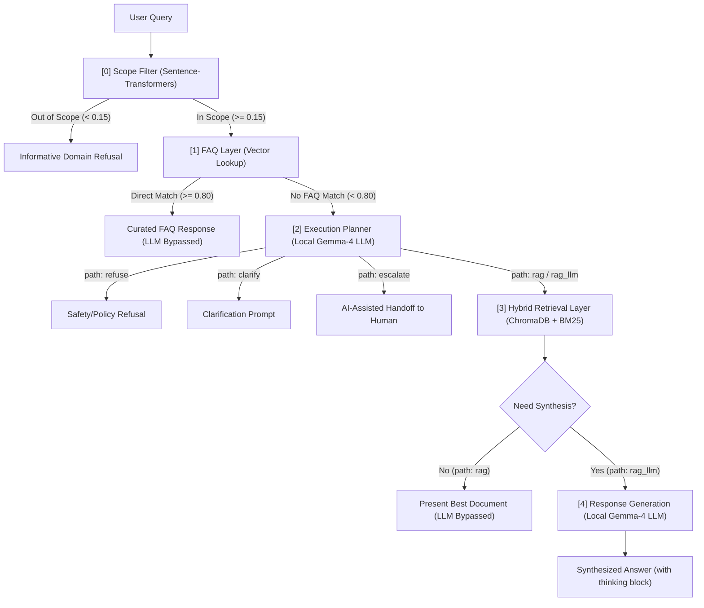

# AI Support Routing System

**Customer support routing and retrieval system that combines deterministic semantic filters, hybrid vector/lexical search, role-based metadata access control, and local LLM inference to minimize unnecessary generation.**

---

Rather than routing every query through an LLM, this system applies **progressive escalation**: queries are resolved at the cheapest possible stage—scope filtering, FAQ lookup, or direct document retrieval—before invoking generative synthesis. The retrieval layer uses a production-grade hybrid search pipeline (BM25 + ChromaDB + RRF + Cross-Encoder re-ranking) with metadata role filters to prevent internal policy leakage.

<p align="center">
    <kbd>
        
    </kbd>
</p>

---

## 🎯 Design Principles

* **Deterministic Before Probabilistic**: Scope filtering and FAQ lookup resolve the majority of repetitive queries in under 20ms at zero token cost—LLM inference is reserved for requests that genuinely require it. *Risk: static similarity thresholds can misclassify edge-case queries as out-of-scope.*
* **Hybrid Search for Alphanumerics**: Pure vector embeddings degrade silently on exact alphanumeric strings—a query for `VT-Titan_XL-99` may semantically match the wrong document with no error signal. BM25 alongside dense retrieval catches what embeddings miss.
* **Separation of Access Scopes (Soft RBAC)**: Internal employee policies are segmented from customer documents at retrieval time using metadata filters. This is an application-layer constraint, not a cryptographic boundary—sufficient for a prototype, but must be replaced with network-level isolation in production.
* **Graceful Degradation over Hallucination**: Every stage has an explicit failure path: synthesis falls back to raw retrieved documents; empty retrieval returns a static refusal. A confident but fabricated answer is treated as a worse outcome than no answer.

---

## 🏗️ System Architecture



---

## 📈 Benchmarks

### Expected Latency

| Outcome Path | Active Components | LLM Passes | Expected Runtime |
| :--- | :--- | :---: | :--- |
| **Out of Scope** | Scope Filter | 0 | < 20 ms |
| **Direct FAQ Match** | Scope Filter + FAQ Layer | 0 | < 20 ms |
| **Planner Direct** (refuse/clarify/escalate) | + Planner | 1 (reasoning=OFF) | ~4–5 s (cached) |
| **RAG Direct** | + ChromaDB | 1 (reasoning=OFF) | ~4–5 s (cached) |
| **RAG LLM Synthesis** | + ChromaDB + LLM | 2 (reasoning=ON) | ~13–15 s (cached) |

*Note: Latency profiles reflect local CPU inference with Gemma-4 E2B. GPU inference or cloud LLM inference services reduce these to sub-second speeds.*

**The two-stage Planner → Synthesis pipeline only justifies its overhead when a substantial share of traffic is resolved by cheaper deterministic paths** (FAQ bypass, scope refusal, direct retrieval). In domains where most queries ultimately require LLM synthesis, the Planner adds latency with no proportional benefit—a simpler single-pass RAG is the better choice.

### Routing Accuracy & Retrieval Quality

The evaluation was performed against a [golden dataset](data/eval/dataset.json) containing 60 queries covering FAQ lookup, retrieval, synthesis, escalation, clarification, and out-of-scope scenarios.

* **Routing Path Accuracy**: **88.3%** (53/60 queries correctly routed)
* **Retrieval Hit@1**: **96.9%** (31/32 retrieval queries ranked the target context first, which is directly presented to the user for `rag` path)
* **Retrieval Hit@5**: **100.0%** (32/32 retrieval queries successfully retrieved the target context)

Retrieval quality was further evaluated using **RAGAS** on the `rag_llm` generation path:

| Metric | Faithfulness | Context Recall | Context Precision | Answer Relevance |
| --- | --- | --- | --- | --- |
| **Score** | 0.764 | 1.000 | 0.857 | 0.783 |

The results show strong retrieval reliability, while remaining errors primarily occur at routing boundaries (e.g., deciding between direct retrieval, synthesis, escalation, and clarification). See [TECHNICAL.md](TECHNICAL.md) for detailed failure analysis and improvement roadmap.

---

## 🛠️ Tech Stack

| Component | Tools |
| :--- | :--- |
| **Vector Database** | ChromaDB (local persistence) |
| **Embeddings Model** | sentence-transformers (`all-MiniLM-L6-v2`) |
| **Retrieval** | Hybrid Search (BM25 + Dense, fused with RRF) |
| **Re-ranking Model** | CrossEncoder (`ms-marco-MiniLM-L-6-v2`) |
| **Document Parser** | IBM Docling (page-based partitioning) |
| **Inference Engine** | llama.cpp [(b9840 CPU Binary)](https://github.com/ggml-org/llama.cpp/releases/tag/b9840) |
| **Model Weights** | [unsloth/gemma-4-E2B-it-GGUF Q4_K_XL](https://huggingface.co/unsloth/gemma-4-E2B-it-GGUF) |
| **User Interface** | Streamlit |

---

## 🚀 Quick Start

```powershell
git clone https://github.com/Yiu-dororong/AI-support-routing-system.git
cd AI-support-routing-system
python -m venv .venv
.venv\Scripts\Activate.ps1
pip install -r requirements.txt
copy .env.example .env
streamlit run app/main.py
```

*(Optional)* Configure Langfuse and Hugging Face credentials in `.env`. The llama.cpp binary and all models we used (Gemma, reranker, sentence transformer) are auto-downloaded on first run.

```powershell
python -m pytest                       # unit tests
python evaluation/run_eval.py          # offline benchmark (60-query golden dataset)
```

<details>
<summary><b>File Structure</b></summary>

```text
router/
├── .streamlit/config.toml             # Streamlit configuration
├── data/
│   ├── chroma_db/                     # Persistent vector database
│   ├── intents.json                   # Scope filter intent centroids
│   ├── Ecommerce_FAQ_Chatbot_dataset.json
│   └── documents/                     # Knowledge base PDFs
├── evaluation/
│   ├── run_eval.py                    # Offline benchmark runner
│   └── ragas_eval.py                  # RAGAS stubs (planned)
├── llama_bin/llama-server.exe         # Auto-downloaded llama.cpp binary
├── llm/gemma-4-E2B-it-UD-Q4_K_XL.gguf
├── reranker/
├── embeddings/
├── app.py                             # Streamlit entry point
├── router_logic.py                    # Routing pipeline
├── prompts.py                         # LLM system prompts
├── requirements.txt
└── pyproject.toml                     # Ruff + pytest config
```

</details>

---

### 🧩 MCP Extension (Optional)

While a hybrid RAG pipeline retrieves stable documentation (FAQs, guides) effectively, it cannot handle **live transactional data** (e.g., order history) or **rapidly changing operational knowledge** (e.g., active promotion dates) which do not belong in a static vector index. 

* **Architecture**: The **Execution Planner** decides in a single grammar-constrained pass if external tools are needed. The `ToolExecutor` dispatches calls concurrently (`asyncio.gather()`) to a custom PostgreSQL MCP server (for transactions) and an official Notion MCP server (for promotions), merging results with RAG context into the synthesis LLM.
* **Performance**: Across **11 test scenarios**, the planner achieved **90.9% (10/11 cases) accuracy** in tool selection and routing. The only failure occurred on the query *"Can you show me my recent purchase history?"*, where the llm explained how to find history rather than used database records via MCP.
* **Trade-Offs**: MCP extends system capability to live databases and dynamic CMS data, but introduces extra architectural complexity and execution latency (e.g., database connection timeouts).
* **Future Scaling**: Exposing all tool schemas directly to the planner works for small sets, but clutters context windows at scale. The future roadmap includes a **Tool Retrieval** layer to dynamically retrieve and bind only the most relevant tools before planning, keeping decoding fast and context efficient.

---

## 🔍 Observability

The Streamlit dashboard provides real-time slider controls for the **Scope**, **FAQ**, and **Retrieval** thresholds, interactive bar charts of similarity scores against intent clusters, and raw JSON output from the execution planner. Optionally, set `LANGFUSE_PUBLIC_KEY` and `LANGFUSE_SECRET_KEY` in `.env` to enable full execution trace logging across every routing phase.

---

## 📈 Scaling Roadmap

1. **Semantic Cache**: Add a Redis cache ahead of the Scope Filter to short-circuit repeated queries at zero compute cost.
2. **Specialized Router Model**: Replace the 2B LLM planner with a fine-tuned BERT classifier for sub-10ms routing latency.
3. **Stateful Conversations**: Append conversation history to prompts for multi-turn support, with KV-cache pruning or sliding-window context management.

---

## 📝 Development Notes

> This project evolved from an experimental RAG document assistant into a modular orchestration system as requirements for deterministic routing, bounded inference, and human escalation emerged.

*For implementation internals—chunking strategy, hybrid search design, RBAC mechanics, evaluation results, and local inference optimizations—see [TECHNICAL.md](TECHNICAL.md).*
