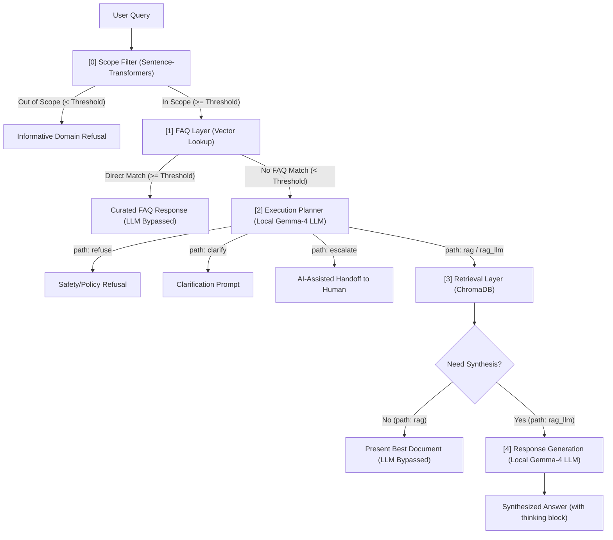

# AI Support Routing System 

**Routing system for e-commerce customer support that combines deterministic routing, bounded retrieval, and local LLM inference to minimise unnecessary generation while preserving reliable support workflows.**

---

Large language models are often treated as the entry point for AI assistants. This project explores the opposite design philosophy. Rather than routing every customer query directly through an LLM, the system progressively escalates requests through deterministic semantic filters, curated retrieval, and local generation only when each cheaper alternative has been exhausted.

The result is an orchestration pipeline designed around predictable behaviour, bounded inference, and explicit uncertainty—prioritising engineering control over maximal model usage.

---

## 🎯 Design Principles

* **Deterministic Before Probabilistic**: Resolve or reject queries using fast, cached semantic lookups (Scope and FAQ layers) before invoking generative models. *Risk*: Static similarity thresholds can cause false positives, misclassifying valid queries as out-of-scope or routing them to incorrect FAQs.
* **LLM as a Controlled Capability**: Treat the LLM as a schema-constrained utility rather than the main loop. Enforce output structures via Pydantic schemas (supporting Enums if needed) using LangChain bindings to guarantee JSON structure during planning and strict grounding during synthesis.
* **Graceful Degradation over Silent Failure**: Explicitly handle failure modes at each stage. Present raw retrieved documents if synthesis fails, and return static domain refusals if retrieval returns nothing, eliminating hallucinations.
* **Bounded Latency via Single-Pass Retrieval**: Execute search database lookups in a single pass without multi-turn agent loops, guaranteeing predictable response latency bounds suitable for real-time support.

---

## 🏗️ System Architecture

The pipeline processes user queries sequentially, escalating through each layer based on similarity metrics and path classification:



---

## ⚙️ Pipeline Design

The pipeline consists of five sequential stages implemented in `router_logic.py`.

### 1. Scope Filter (`run_scope_filter`)
* **Problem**: Out-of-scope queries consume computation resources and expose the downstream LLM to potential safety risks.
* **Decision**: Compute semantic similarity againstcentroids of pre-defined intent clusters (`data/intents.json`) using `all-MiniLM-L6-v2` via `sentence-transformers`. Queries scoring below the **Scope Threshold** (default: `0.40`) are rejected immediately with a static refusal.
* **Trade-off**: Setting thresholds too high increases false negatives (rejecting valid queries), while setting them too low lets noise pass.

### 2. FAQ Layer (`run_faq_layer`)
* **Problem**: Repetitive queries do not require dynamic contextual reasoning or expensive LLM generation.
* **Decision**: Perform vector distance searches against embedded Q&A pairs (`data/Ecommerce_FAQ_Chatbot_dataset.json`). If a query matches above the **FAQ Match Threshold** (default: `0.80`), the curated static answer is returned instantly, bypassing the LLM.
* **Trade-off**: Fast and cost-free, but static answers cannot adapt to dynamic query parameters (e.g. cart totals, order details).

### 3. Execution Planner (`run_execution_planner`)
* **Problem**: Natural language model outputs are non-deterministic and fragile to parse programmatically for pipeline routing.
* **Decision**: Classify requests into one of five structured paths (`refuse`, `clarify`, `rag`, `rag_llm`, `escalate`) using local `Gemma-4-E2B-it` served via `llama.cpp`. Output schemas are strictly enforced using LangChain's native Pydantic parser bindings.
* **Trade-off**: Enforcing schema constraints on LLM generation increases classification latency but guarantees 100% parseable, deterministic routing.

### 4. Retrieval Layer (`run_retrieval_layer`)
* **Problem**: Support documents contain tables and rate matrices that naive text chunking destroys, making numerical lookup unreliable.
* **Decision**: Parse PDF files using IBM's `Docling` engine to preserve markdown tables, store them in a local `ChromaDB` database, and enforce a **Retrieval Similarity Threshold** (default: `0.30`) to filter out low-confidence context.
* **Trade-off**: Ingestion is slower than standard character chunking. Rendering complex tables and unstructured markdown cleanly inside chat dialogue containers also remains a visual/parsing challenge.

### 5. Response Synthesis (`run_response_generation`)
* **Problem**: Presenting raw text chunks is verbose and difficult for users to scan.
* **Decision**: Generate grounded answers using `Gemma-4-E2B-it` with structured prompts (`prompts.py`). The model is instructed to output a visible reasoning `<thought>` block before the response, and is strictly restricted to retrieved document contents.
* **Trade-off**: Executing a secondary LLM synthesis pass introduces latency, which is why it is reserved exclusively for the `rag_llm` path.

---

## ⚡ Local Inference Optimizations

Executing reasoning-capable models locally on consumer CPU hardware presents significant latency challenges. The following optimization patterns were implemented in `router_logic.py` to ensure acceptable response times.

### Prefix Prompt Caching via Suffix Formatting
To leverage prefix caching in `llama.cpp` and avoid re-evaluating static system instructions (~600 tokens) on CPU for every query, prompt templates place static system prompts as a prefix and dynamic inputs (user query and retrieved context) as a trailing suffix. This **preserves the KV-cache**, reducing subsequent routing runs from 9.66s to 4.12s (a **2.3x speedup**).

### Local Server Layout (Dual-Server Recommended)
Generating reasoning tokens (Gemma's `<thought>` block) is compute-heavy. This prototype operates a single local `llama-server` instance with `--reasoning off`. In production, we recommend a dual-server layout: a low-latency Planner instance running with **reasoning disabled** (`--reasoning off`, dropping routing times from 12.54s to 1.56s—an **8.0x speedup**), and a separate Synthesis instance running with reasoning enabled (`--reasoning on`) for executing RAG synthesis.

<details>
<summary><b>Common llama.cpp reasoning configuration options</b></summary>

```text
 --reasoning [on|off|auto]              Use reasoning/thinking in the chat ('on', 'off', or 'auto')
                                        (env: LLAMA_ARG_REASONING)
--reasoning-budget N                    Token budget for thinking: -1 for unrestricted, 0 for immediate end
                                        (env: LLAMA_ARG_THINK_BUDGET)
--reasoning-budget-message MESSAGE      Message injected before the end-of-thinking tag when reasoning budget is exceeded
                                        (env: LLAMA_ARG_THINK_BUDGET_MESSAGE)
```
</details>

### Model Warm-up during Initialization
Because `llama-server` employs lazy loading and CPU schema tree compilation on the first incoming request, the initial query faces a **~9.46s cold start**. The `SupportRouter` startup routine **executes a dummy query during system initialization to warm up** model weights and JSON parsing state, **reducing first-query latency to 5.01s** (a 4.5s speedup).

---

### 📈 Benchmarks & Trade-offs 

The progressive triage architecture ensures that queries are resolved at the lowest possible computational cost and latency. Based on actual local CPU inference profiles, the expected runtimes for each path are:

| Outcome Path | Trigger Condition | Active Components | LLM Generation | Expected Runtime |
| :--- | :--- | :--- | :---: | :--- |
| **Out of Scope** | Semantic Scope similarity < **Scope Threshold** | Scope Filter | Bypassed | < 20 ms |
| **Direct FAQ Match** | FAQ similarity >= **FAQ Match Threshold** | Scope Filter + FAQ Layer | Bypassed | < 20 ms |
| **Planner Direct (Refuse/Clarify/Escalate)** | Planner path `refuse`, `clarify`, or `escalate` | Scope Filter + FAQ + Planner | 1 Pass (reasoning=OFF) | ~4.0 s - 5.0 s (cached) |
| **RAG Direct** | Planner path `rag` + Retrieval similarity >= **Retrieval Threshold** | Scope + FAQ + Planner + ChromaDB | 1 Pass (reasoning=OFF) | ~4.0 s - 5.0 s (cached) |
| **RAG LLM Synthesis** | Planner path `rag_llm` + Retrieval similarity >= **Retrieval Threshold** | Scope + FAQ + Planner + ChromaDB + LLM | 2 Passes (reasoning=ON) | ~13.0 s - 15.0 s (cached) |

> [!NOTE]
> **Hardware Context & Latency Bounds**: These latency profiles reflect a local CPU deployment of the Gemma-4 2B model. Runtimes can be reduced to sub-second or sub-100ms speeds by serving the model on a dedicated GPU or utilizing hosted API endpoints.

**Cost & Latency Trade-offs**:
* **Cost Reduction**: Out-of-scope and FAQ requests are resolved in under 20ms at zero LLM token cost, and by routing simple lookups to `RAG Direct` (LLM bypassed during document presentation), the system avoids secondary synthesis costs.
* **Architectural Assumption**: Adding the Planner layer introduces a **double-pass LLM pipeline** for synthesis queries (`Planner` pass + `Synthesis` pass), which doubles the token cost and generation latency. This pattern is **highly effective only when the deterministic FAQ database is comprehensive enough to capture most queries** (bypassing the LLM entirely). Otherwise, if most queries fall through to the LLM, the Planner adds unnecessary overhead and latency compared to a single-pass RAG pipeline.

---

## 🛠️ Tech Stack 

The system is built on a local-first Python stack:

| Component | Library/Tool | 
| :--- | :--- | 
| **Core Runtime** | Python  3.10+ |
| **Vector Database** | chromadb  |
| **Semantic Embeddings** | sentence-transformers (all-MiniLM-L6-v2) |
| **Document Ingestion** | Docling |
| **Local LLM Runner** | llama.cpp [(b9840 CPU Binary)](https://github.com/ggml-org/llama.cpp/releases/tag/b9840) |
| **Planner & LLM** | [unsloth/gemma-4-E2B-it-GGUF Q4_K_XL](https://huggingface.co/unsloth/gemma-4-E2B-it-GGUF) |
| **Frontend** | streamlit


---

## 🚀 Quick Start

1. **Clone & Setup Environment**:
   ```bash
   git clone https://github.com/Yiu-dororong/RAG-chatbot.git
   cd RAG-chatbot
   python -m venv .venv
   .venv\Scripts\Activate.ps1
   pip install -r requirements.txt
   ```
2. **Config**:
   * *(Optional)* ```copy .env.example .env``` to configure Langfuse API & huggingface credentials. <br/> *Note: The llama.cpp and Gemma LLM weights are automatically downloaded from Hugging Face Hub and saved to the local `llm/` directory on the first execution.*
3. **Execution**:
   * **Test**: `python -m pytest`
   * **Run**: `streamlit run app.py` (starts the local backend `llama-server` automatically)

<details>
<summary><b>File Structure</b></summary>

```text
router/
├── .streamlit/
│   └── config.toml                         # Streamlit configuration options
├── data/
│   ├── chroma_db/                          # Persistent vector database files
│   ├── intents.json                        # Intent centroid definition queries
│   ├── Ecommerce_FAQ_Chatbot_dataset.json  # Curated e-commerce FAQ dataset
│   └── documents/                          # VoltVibe knowledge base PDF documents
├── llama_bin/
│   └── llama-server.exe                    # Local llama.cpp runner binary (Generated automatically on first run)
├── llm/
│   └── gemma-4-E2B-it-UD-Q4_K_XL.gguf      # Automatically downloaded model weights
├── .env.example                            # Template environment configuration file
├── app.py                                  # Streamlit playground and visualization code
├── router_logic.py                         # Routing pipeline implementation code
├── prompts.py                              # System instruction prompts
├── requirements.txt                        # Package dependencies file
└── pyproject.toml                          # Ruff and pytest configuration options
```

</details>

---

## 🔍 Observability

To inspect and debug the routing prototype, the primary interface is the interactive Streamlit playground, while the codebase supports an optional Langfuse integration for execution flow tracking.

### Interactive Streamlit Playground
The dashboard exposes real-time slider controls to dynamically adjust the **Scope Threshold**, **FAQ Match Threshold**, and **Retrieval Similarity Threshold**. It visualizes similarity scores against in-scope intent clusters using interactive bar charts and prints the raw JSON output from the local execution planner. This simplifies visual debugging and edge-case testing.

### Langfuse (Optional)
For production monitoring, the pipeline integrates with Langfuse to automatically collect execution traces. If keys (`LANGFUSE_PUBLIC_KEY` and `LANGFUSE_SECRET_KEY`) are configured in the environment, the pipeline logs every routing phase—from semantic similarity filters to document retrieval and LLM response generation—as a session.

---

## 📈 Scaling Guidelines

To move this system from prototype to high-volume production:
1. **Semantic Cache**: Insert a cache layer (e.g. Redis) ahead of the Scope Filter to instantly resolve identical or highly similar user queries, reducing embedding computation overhead.
2. **Hybrid Retrieval**: Combine dense semantic embeddings with sparse keyword search (BM25) to prevent retrieval failure on precise codes (e.g., product model numbers or SKU codes).
3. **Reranking**: Implement a cross-encoder model (e.g. Cohere or BGE reranker) after retrieval to re-evaluate the relevance of the top 10 chunks, feeding only the top 3 highly relevant sources to the LLM.
4. **Specialized Router Models**: Replace the 2B LLM planner with a fine-tuned Bert classification model for path selection, reducing routing latency to sub-10 milliseconds.
5. **Stateful Conversation Management**: The current system is stateless. While it can be expanded to support multi-turn dialogues by appending conversation history to the prompt inputs, this introduces local context length limitations and requires KV-cache pruning or sliding window context management.

---

**Development Notes**

This repository began as an experimental retrieval-augmented document assistant. As additional operational requirements emerged—including deterministic routing, bounded inference, and human escalation—the architecture was progressively refactored into a modular AI support orchestration system.
