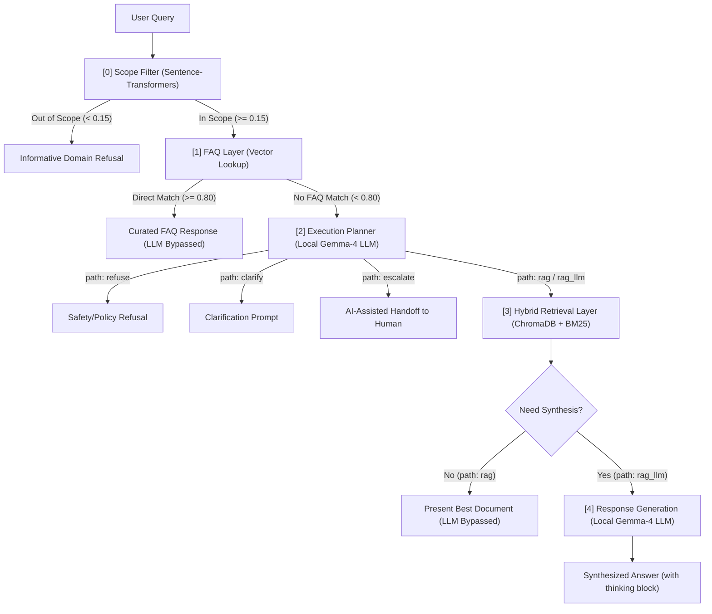

# AI Support Routing System

**Customer support routing and retrieval system that combines deterministic semantic filters, hybrid vector/lexical search, role-based metadata access control, and local LLM inference to minimize unnecessary generation.**

---

Rather than routing every query through an LLM, this system applies **progressive escalation**: queries are resolved at the cheapest possible stage—scope filtering, FAQ lookup, or direct document retrieval—before invoking generative synthesis. The retrieval layer uses a production-grade hybrid search pipeline (BM25 + ChromaDB + RRF + Cross-Encoder re-ranking) with metadata role filters to prevent internal policy leakage.

<p align="center">
    <kbd>
        
    </kbd>
</p>

---

## 🎯 Design Principles

* **Deterministic Before Probabilistic**: Run fast semantic lookups (Scope Filter, FAQ) before invoking any generative model.
* **Hybrid Search for Alphanumerics**: Combine dense vector search (ChromaDB) with sparse lexical search (BM25) to handle exact product codes and SKUs that embeddings alone miss.
* **LLM as a Schema-Constrained Utility**: Enforce JSON output structures via Pydantic schemas and LangChain grammar bindings—LLM is a tool, not the main loop.
* **Separation of Access Scopes (Soft RBAC)**: Segment internal employee policies from customer documents using retrieval-time metadata filters.
* **Graceful Degradation over Hallucination**: Serve raw retrieved documents if synthesis fails; return static refusals if retrieval returns empty.

---

## 🏗️ System Architecture



---

## ⚙️ Pipeline Stages

| Stage | Description |
| :--- | :--- |
| **[0] Scope Filter** | Rejects out-of-scope queries via cosine similarity against intent centroids. Queries below the **Scope Threshold** (default: `0.15`) receive an informative refusal. |
| **[1] FAQ Layer** | Returns curated FAQ answers above the **FAQ Match Threshold** (default: `0.80`), bypassing the LLM entirely. |
| **[2] Execution Planner** | Classifies queries into `refuse`, `clarify`, `rag`, `rag_llm`, or `escalate` using local Gemma-4, with outputs validated against a Pydantic schema. |
| **[3] Retrieval Layer** | Runs hybrid BM25 + ChromaDB search with RRF fusion and Cross-Encoder re-ranking, filtered by user role metadata. |
| **[4] Response Synthesis** | Generates grounded answers from retrieved context using Gemma-4. Only invoked on the `rag_llm` path. |

---

## 📈 Benchmarks & Expected Latency

| Outcome Path | Active Components | LLM Passes | Expected Runtime |
| :--- | :--- | :---: | :--- |
| **Out of Scope** | Scope Filter | 0 | < 20 ms |
| **Direct FAQ Match** | Scope Filter + FAQ Layer | 0 | < 20 ms |
| **Planner Direct** (refuse/clarify/escalate) | + Planner | 1 (reasoning=OFF) | ~4–5 s (cached) |
| **RAG Direct** | + ChromaDB | 1 (reasoning=OFF) | ~4–5 s (cached) |
| **RAG LLM Synthesis** | + ChromaDB + LLM | 2 (reasoning=ON) | ~13–15 s (cached) |

> [!NOTE]
> Latency profiles reflect local CPU inference with Gemma-4 2B. GPU or hosted API deployments reduce these to sub-second speeds. The Planner overhead is only worthwhile when a significant share of traffic is resolved by cheaper deterministic paths—see [TECHNICAL.md](TECHNICAL.md) for a full cost trade-off discussion.

---

## 🛠️ Technology Stack

| Component | Technology |
| :--- | :--- |
| **Core Runtime** | Python 3.10+ |
| **Vector Database** | ChromaDB (local persistence) |
| **Embeddings Model** | sentence-transformers (`all-MiniLM-L6-v2`) |
| **Lexical Engine** | rank_bm25 |
| **Re-ranking Model** | CrossEncoder (`ms-marco-MiniLM-L-6-v2`) |
| **Document Parser** | IBM Docling (page-based partitioning) |
| **Inference Engine** | llama.cpp [(b9840 CPU Binary)](https://github.com/ggml-org/llama.cpp/releases/tag/b9840) |
| **Model Weights** | [unsloth/gemma-4-E2B-it-GGUF Q4_K_XL](https://huggingface.co/unsloth/gemma-4-E2B-it-GGUF) |
| **User Interface** | Streamlit |

---

## 🚀 Quick Start

```powershell
git clone https://github.com/Yiu-dororong/AI-support-routing-system.git
cd AI-support-routing-system
python -m venv .venv
.venv\Scripts\Activate.ps1
pip install -r requirements.txt
copy .env.example .env
streamlit run app/main.py
```

*(Optional)* Configure Langfuse and Hugging Face credentials in `.env`. The llama.cpp binary and Gemma model weights are auto-downloaded on first run.

```powershell
python -m pytest                       # unit tests
python evaluation/run_eval.py          # offline benchmark (60-query golden dataset)
```

<details>
<summary><b>File Structure</b></summary>

```text
router/
├── .streamlit/config.toml             # Streamlit configuration
├── data/
│   ├── chroma_db/                     # Persistent vector database
│   ├── intents.json                   # Scope filter intent centroids
│   ├── Ecommerce_FAQ_Chatbot_dataset.json
│   └── documents/                     # Knowledge base PDFs
├── evaluation/
│   ├── run_eval.py                    # Offline benchmark runner
│   └── ragas_eval.py                  # RAGAS stubs (planned)
├── llama_bin/llama-server.exe         # Auto-downloaded llama.cpp binary
├── llm/gemma-4-E2B-it-UD-Q4_K_XL.gguf
├── app.py                             # Streamlit entry point
├── router_logic.py                    # Routing pipeline
├── prompts.py                         # LLM system prompts
├── requirements.txt
└── pyproject.toml                     # Ruff + pytest config
```

</details>

---

## 🔍 Observability

The Streamlit dashboard provides real-time slider controls for the **Scope**, **FAQ**, and **Retrieval** thresholds, interactive bar charts of similarity scores against intent clusters, and raw JSON output from the execution planner. Optionally, set `LANGFUSE_PUBLIC_KEY` and `LANGFUSE_SECRET_KEY` in `.env` to enable full execution trace logging across every routing phase.

---

## 📈 Scaling Roadmap

1. **Semantic Cache**: Add a Redis cache ahead of the Scope Filter to short-circuit repeated queries at zero compute cost.
2. **Specialized Router Model**: Replace the 2B LLM planner with a fine-tuned BERT classifier for sub-10ms routing latency.
3. **Stateful Conversations**: Append conversation history to prompts for multi-turn support, with KV-cache pruning or sliding-window context management.

---

*This project evolved from an experimental RAG document assistant into a modular orchestration system as requirements for deterministic routing, bounded inference, and human escalation emerged.*

> For implementation internals—chunking strategy, hybrid search design, RBAC mechanics, evaluation results, and local inference optimizations—see [TECHNICAL.md](TECHNICAL.md).
